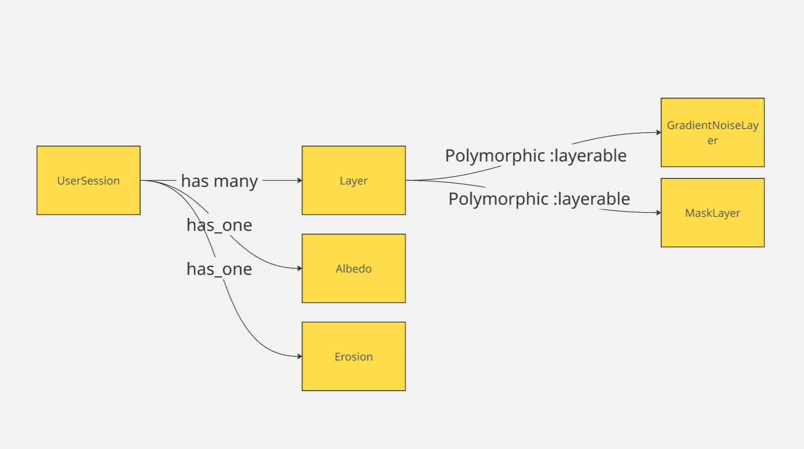

# **mud.land.BE**  

## **Overview**  
*mud.land.BE* is a Rails API that powers a procedural terrain generator. It handles user authentication and terrain data management, serving as a strictly API-only backend with no frontend components.  

## **Backend Features**  
- Handles the source of truth for all terrain data.
- Performs CRUD operations

## Database

  


## API Documentation

---

### UserSession

#### Create a UserSession
- **Endpoint:** `POST /user_sessions`
- **Description:** Creates a new user session.
- **Request Body:** _(optional)_  
  No parameters required.
- **Responses:**
  - `201 Created` – Returns the created user session.
  - `422 Unprocessable Entity` – If creation fails.

---

#### Delete a UserSession
- **Endpoint:** `DELETE /user_sessions/:id`
- **Description:** Deletes a user session and its associated layers.
- **Path Parameters:**
  - `id` – UUID of the user session.
- **Responses:**
  - `204 No Content` – Successfully deleted.
  - `404 Not Found` – If the session is not found.

---

### Layer

#### Get All Layers
- **Endpoint:** `GET /user_sessions/:user_session_id/layers`
- **Description:** Returns all layers for a user session, ordered by position.
- **Path Parameters:**
  - `user_session_id` – UUID of the user session.
- **Responses:**
  - `200 OK` – Returns an array of layers:
    ```json
    [
      {
        "id": "layer_id",
        "position": 0,
        "type": "GradientNoiseLayer",
        "settings": {
          "name": "simplex",
          "blend_mode": "add",
          "opacity": 1.0,
          "octaves": 4
        }
      }
    ]
    ```
  - `404 Not Found` – If the session is not found.

---

#### Create a Layer
- **Endpoint:** `POST /user_sessions/:user_session_id/layers`
- **Description:** Creates a new layer using a type and variant.
- **Path Parameters:**
  - `user_session_id` – UUID of the user session.
- **Request Body:**
  ```json
  {
    "procedural_layer": {
      "type": "GradientNoiseLayer",
      "variant": "simplex"
    }
  }
  ```
- **Responses:**
  - `201 Created` – Returns the created layer with metadata and settings.
  - `422 Unprocessable Entity` – If type or variant is invalid.

---

#### Delete a Layer
- **Endpoint:** `DELETE /user_sessions/:user_session_id/layers/:id`
- **Description:** Deletes a layer and updates positions of remaining layers.
- **Path Parameters:**
  - `user_session_id` – UUID of the user session.
  - `id` – UUID of the layer.
- **Responses:**
  - `204 No Content` – Successfully deleted.
  - `404 Not Found` – If layer is not found.
  - `422 Unprocessable Entity` – If deletion fails.

---


## **Frontend Features**  
- WebGPU compute shaders for heightmap generation
- Single page app (SPA) using vanilla JS with Typescript transpiler.
- Stacking and blending of noise gradients (e.g., Simplex, Voronoi) with masking and fall-offs  
- Erosion simulation over time  
- Manual terrain editing:  
  - Pour water to simulate erosion through rivers and lakes  
  - Raise terrain to block water flow  
- Custom colorization using materials  
- Export terrain as a heightmap image or mesh

## **Current Frontend Version**  

  

The screenshot above showcases a **4K heightmap texture** running at **60 FPS (capped)** on a **GTX 970 (4GB RAM)**.  
Future plans include support for **8K resolution using tiled textures**, though **4K is sufficient for now**.  

*(Disclaimer: I’m not a designer!)*  
