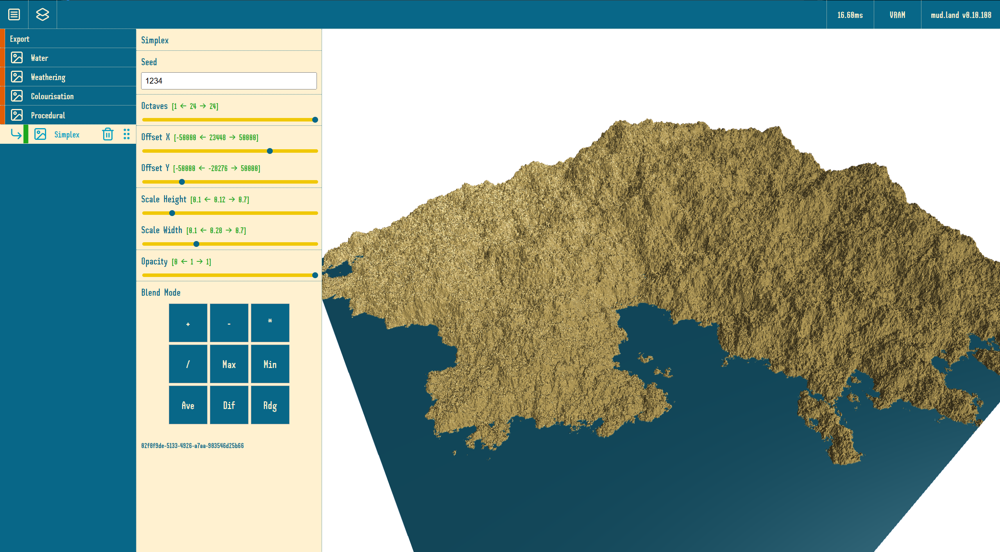

# **mud.land.BE**  

## **Overview**  
*mud.land.BE* is a Rails API that powers a procedural terrain generator. It handles user authentication and terrain data management, serving as a strictly API-only backend with no frontend components.  

## **Backend Features**  
- Secure user authentication  
- CRUD operations for terrain data  
- Protected API endpoints  
- Data management for procedural terrain generation  

## **Frontend Features**  
- WebGPU compute shaders for heightmap generation  
- Stacking and blending of noise gradients (e.g., Simplex, Voronoi) with masking and fall-offs  
- Erosion simulation over time  
- Manual terrain editing:  
  - Pour water to simulate erosion through rivers and lakes  
  - Raise terrain to block water flow  
- Custom colorization using materials  
- Export terrain as a heightmap image or mesh  

## **Current Frontend Version**  

  

The screenshot above showcases a **4K heightmap texture** running at **60 FPS (capped)** on a **GTX 970 (4GB RAM)**.  
Future plans include support for **8K resolution using tiled textures**, though **4K is sufficient for now**.  

*(Disclaimer: I’m not a designer!)*  
